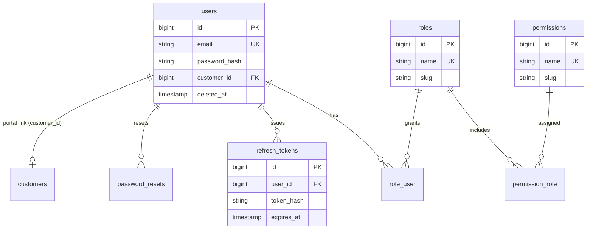
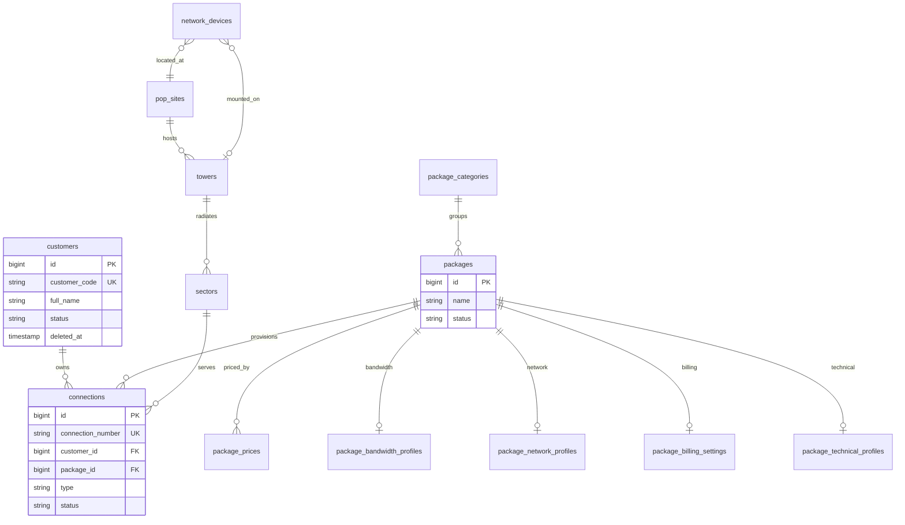
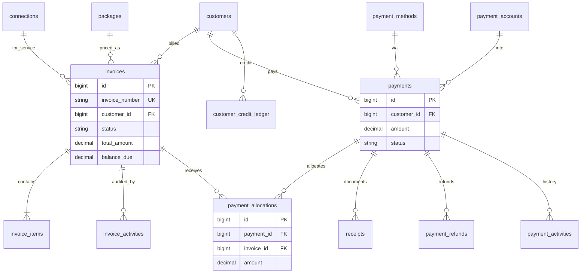
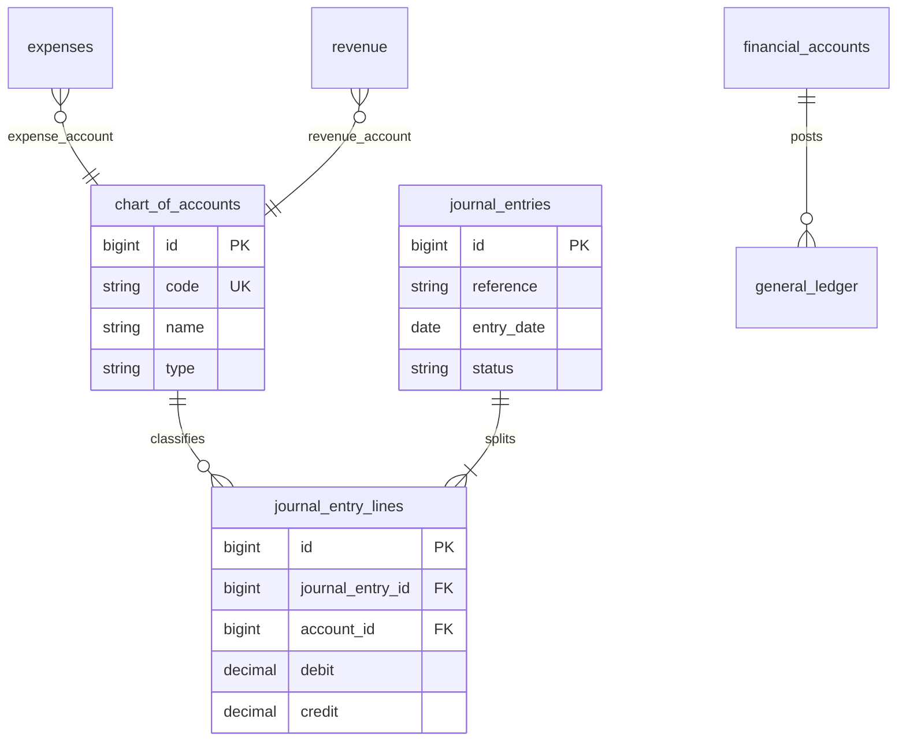
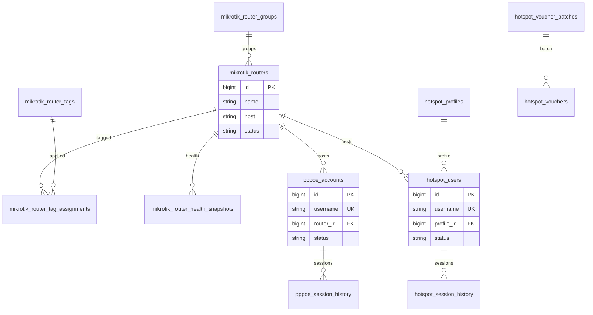
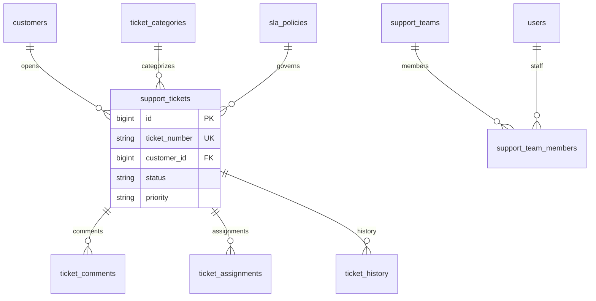
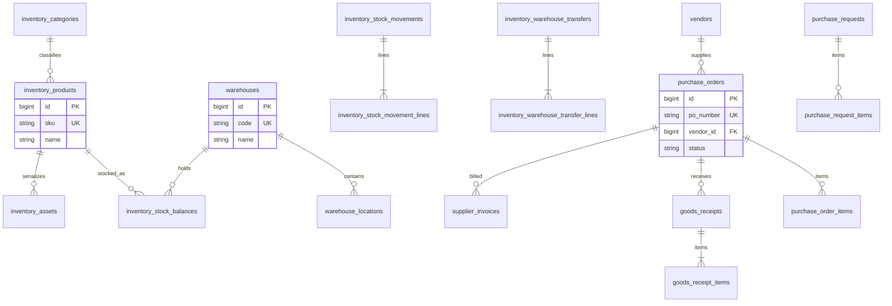
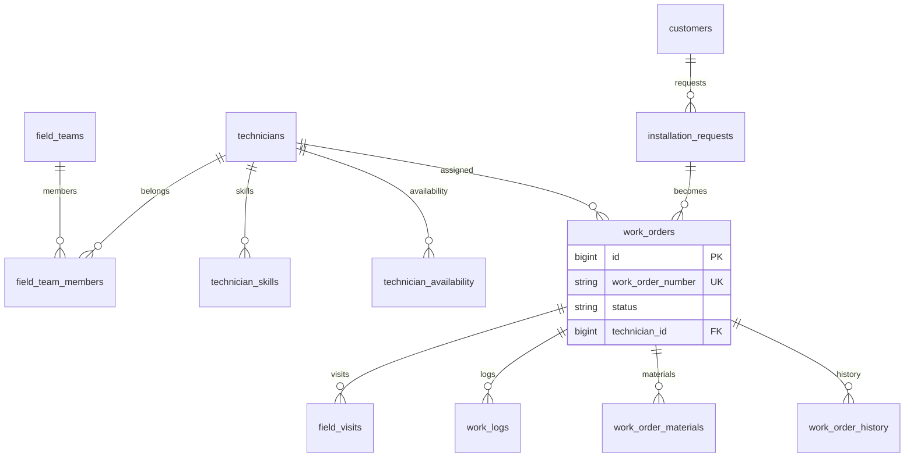
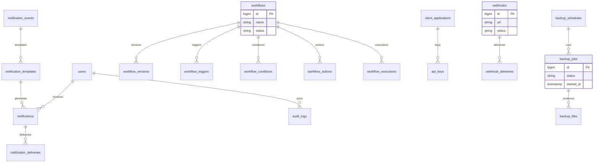
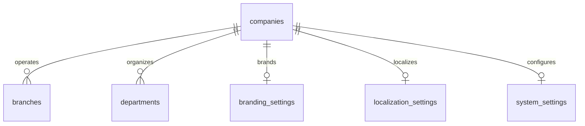

# Entity Relationship Diagrams

Mermaid ER diagrams for the **implemented** SkyFi schema. These diagrams highlight primary relationships used by application code; they are not exhaustive column catalogs. Full DDL lives in `backend/database/migrations/`.

## 1. Identity, RBAC, and auth

## 2. Customers, packages, and connections

## 3. Billing and payments

## 4. Finance ledger

## 5. Network operations (MikroTik / PPPoE / Hotspot)

## 6. Support tickets

## 7. Inventory and purchasing

## 8. Field service

## 9. Notifications, audit, backup, integration, workflow

## 10. System administration

## 11. How to regenerate / extend diagrams

When schema changes:

1. Update the relevant migration SQL.
2. Adjust the Mermaid diagram(s) in this file in the same PR.
3. Keep diagrams relationship-focused; avoid listing every column.
4. For deep dives, link to the migration file name.

Rendering: GitHub and most Markdown previewers support Mermaid natively.
